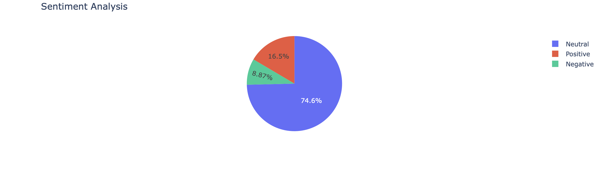
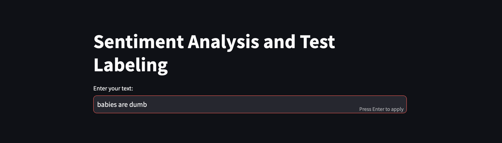
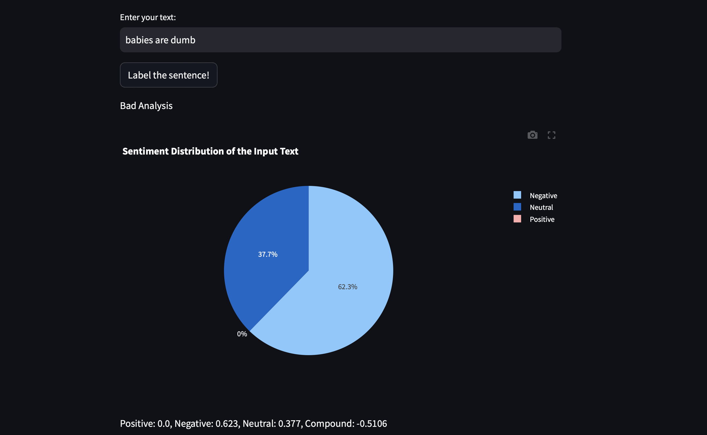

# Movie Reviews Sentiment Analysis & Binary Classification

This project focuses on **sentiment analysis** and **binary classification** of movie reviews sourced from a Kaggle dataset. The raw text data contains numerous links, special characters, and stop words, requiring extensive preprocessing. After cleaning and vectorizing the text, multiple classification models were tested, with **Multinomial Naive Bayes** performing best. Finally, a **Streamlit** application was built for user-friendly interaction with the model and sentiment analysis.

---

## Overview
1. **Sentiment Analysis**: Determine if movie reviews are positive, negative, or neutral using the **VADER** sentiment library.  
2. **Text Classification**: Classify reviews into “bad” (0) or “good” (1) using **TF-IDF** vectorization and **Multinomial Naive Bayes**.  
3. **Streamlit App**: Provide an easy-to-use interface for entering text, visualizing sentiment scores, and displaying classification results.

---

## Table of Contents
1. [Sentiment Analysis Part](#sentiment-analysis-part)  
2. [Text Classification Part](#text-classification-part)  
3. [Streamlit App Part](#streamlit-app-part)

---

## 1. Sentiment Analysis Part 

### A. Text Processing
- **Libraries Used**: `neattext` and `num2words` to handle special characters, convert numbers to words, and remove stop words.  
- **Language Check**: Ensured all reviews were in English; non-English texts were either translated or removed as needed.

### B. Sentiment Analysis
- **Library**: `vaderSentiment` (`SentimentIntensityAnalyzer`) to compute sentiment scores.  
- **Interactive Pie Chart**: Created with **Plotly Express** to visualize the distribution of positive, negative, and neutral sentiments.

  

- **Individual Scores**: A code block prints sentiment details for any specific review by index.

---

## 2. Text Classification Part 

### A. Preprocessing
- **TF-IDF (Term Frequency–Inverse Document Frequency)**: Vectorized the cleaned text data to capture word importance based on frequency.

### B. Model Building
- **Traditional Classifiers**: Tested various algorithms (e.g., Logistic Regression, SVM, Multinomial Naive Bayes).  
- **Hyperparameter Tuning**: Applied Grid Search on the alpha parameter for **Multinomial Naive Bayes**, but observed minimal improvement.  
- **Kaggle Submission**: Predicted labels on the test set for final submission.

---

## 3. Streamlit App Part 

**Overview**: The Streamlit app simplifies user interaction by handling both sentiment analysis and classification without needing a separate backend.

### A. Text Input & Classification
- **User Input**: Enter a movie review or any text to receive an immediate classification (0 = bad, 1 = good).

  

### B. Sentiment Scores
- **Interactive Pie Chart**: Displays sentiment breakdown (positive, negative, neutral) using Plotly.  
- **Numerical Output**: Shows exact sentiment scores from VADER.

  

---

## Conclusion
By combining **VADER** sentiment analysis, **TF-IDF** vectorization, and **Multinomial Naive Bayes**, this project successfully classifies movie reviews as positive or negative. The **Streamlit** app further provides a convenient interface for both technical and non-technical users, offering interactive visualizations and real-time sentiment feedback. Future enhancements might include experimenting with deep learning approaches (e.g., LSTM, BERT) or additional preprocessing steps to handle more nuanced language features.
